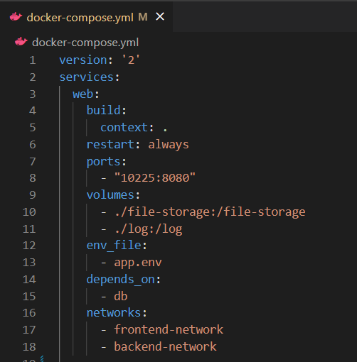
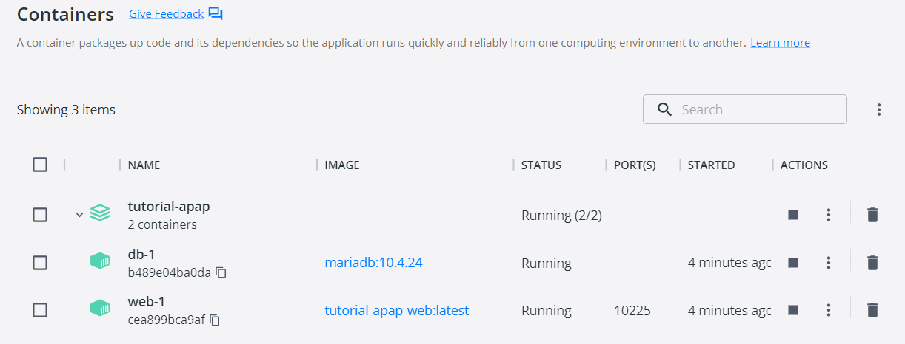
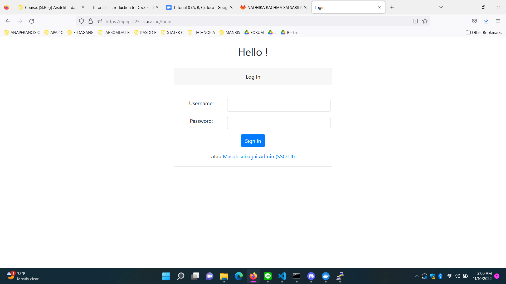
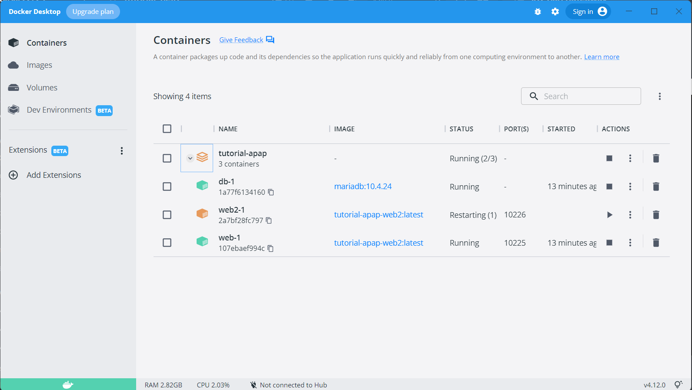
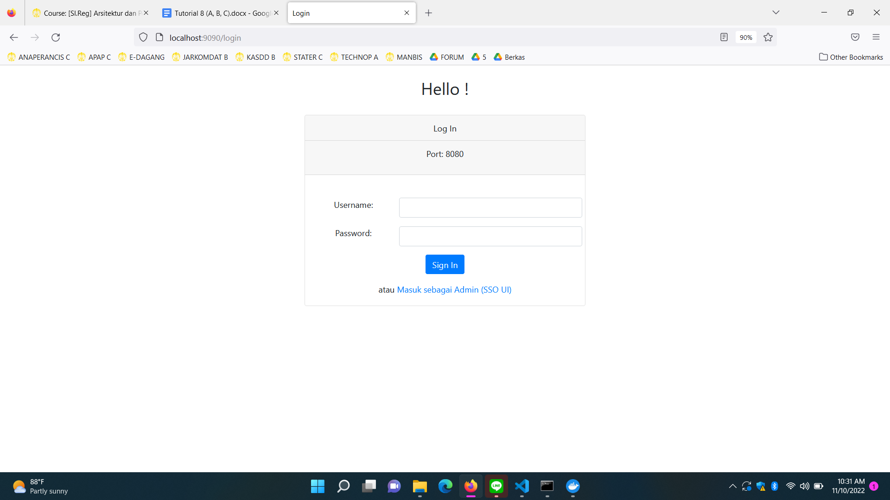
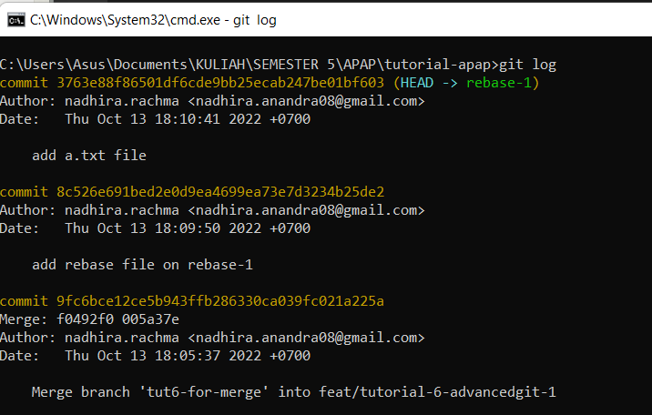
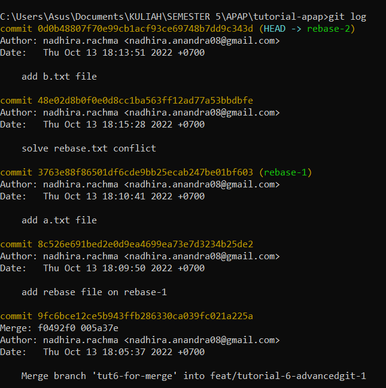

# Tutorial APAP
## Authors
* **Nadhira Rachma Salsabila Anandra** - *2006484974* - *C*

---
## Tutorial 8

### What I have learned today
1. Apa itu Dockerfile dan docker-compose.yaml? Apa fungsinya?
- Dockerfile merupakan sebuah dokumen yang berisi seluruh perintah yang dapat dilakukan oleh user pada command line untuk membangun dan memasang sebuah image yang merupakan dokumen penunjang aplikasi.
- Docker-compose.yaml merupakan sebuah dokumen yang berisi konfigurasi dari layanan aplikasi yang berfungsi untuk menjalankan image. 

2. Screenshot hasil perubahan anda. Setelah anda menyelesaikan tutorial ini, menurut anda, mengapa kita perlu mengganti port?

- Port dari masing-masing pengguna bersifat unik dan hanya digunakan oleh satu orang pengguna. Oleh karena itu, setiap mahasiswa perlu mengganti port sesuai dengan nomor urutnya masing-masing. 

3. Mengapa terdapat versi dev dan prod? File apa yang menentukan konfigurasi mana yang dipakai? Apa yang harus dilakukan untuk menjalankan versi prod? (hint: baca file pada langkah 3 dengan teliti)
- Versi dev merupakan versi development yang mencakup keseluruhan proses pengembangan seperti penulisan maupun update program. Konfigurasi dituliskan pada file application-dev.yml.
- Versi prod merupakan versi production yang mencakup produksi dari output program yang telah dibangun. Konfigurasi dituliskan pada file application-prod.yml.
- Untuk menjalankan versi prod, SPRING_PROFILES_ACTIVE pada file app.dev perlu didefinisikan dengan value prod menjadi SPRING_PROFILES_ACTIVE=prod. 

4. Apa saja yang terjadi di langkah ini?
- Perintah docker-compose up berfungsi untuk membuat container pada Docker. Ketika perintah dijalankan, container akan terbuat beserta front end dan back end network dan volumenya.

5. Sertakan screenshot container yang sedang berjalan (versi gui atau cli, pilih salah satu). Apa itu docker container, images, dan volume?

- Container = sebuah environment dimana aplikasi dijalankan yang mencakup kode, runtime, system tools, dan pengaturan
- Images = dokumen-dokumen penunjang aplikasi yang mencakup resource untuk membangun container
- Volume = penyimpanan data dari container yang dapat digunakan untuk berbagi file pada container yang diinginkan

6. Apa perbedaan docker-compose down dan stop?
- Docker-compose down akan menghentikan container namun tidak menghapusnya.
- Docker-compose stop akan menghentikan container sekaligus menghapusnya beserta jaringan yang terbuat.

7. Sertakan screenshot mengakses laman kirti milik anda melalui browser (seperti screenshot di atas)

8. Ceritakan pengalaman anda melakukan deployment ke Kirti. Kendala apa yang anda alami?
- Saat melakukan deployment ke Kirti, saya mengalami kendala berupa ERROR could not find an available, non-overlapping IPv4 address pool among the defaults to assign to the network ketika mengeksekusi docker-compose up -d. Setelahnya, saya mencoba secara terus menerus untuk  mengeksekusi docker-compose up -d hingga berhasil dilakukan. 

9. Buka container docker Anda, lalu screenshot. Apa perbedaan tampilan container sekarang dengan tampilan container pada langkah tutorial docker di awal tadi?

- Container sekarang menjalankan db-1, web-1, dan web2-1 sebagai tambahan dari konfigurasi file docker-compose.yml, app2.env, serta application-prod2.yml.

10. Sertakan screenshot tampilan web ketika pertama kali menjalankan localhost:9090 dan tampilan web ketika halaman di-refresh.

[Tampilan web pertama kali] 

[Tampilan web ketika halaman di-refresh] 

11. Kendala apa yang anda hadapi ketika melakukan tutorial bagian nginx?
- Ketika melakukan tutorial bagian nginx, saya mengalami kendala berupa tulisan port yang tidak muncul pada halaman login. Setelah ditinjau kembali, hal tersebut terjadi karena saya belum membuat jar dan tulisan port berhasil muncul setelah jar dibuat. 

Referensi: 
- https://docs.docker.com/engine/reference/builder/
- https://docs.docker.com/compose/
- https://dev.to/flippedcoding/difference-between-development-stage-and-production-d0p
- https://www.niagahoster.co.id/blog/docker-tutorial/#:~:text=Docker%20image%20%E2%80%94%20Kumpulan%20file%20yang,telah%20ditentukan%20dalam%20Docker%20image
- https://ryanrizky.com/cara-menggunakan-docker-volume/#:~:text=Docker%20Volume%20digunakan%20untuk%20menyimpan,file%20kepada%20Container%20yang%20diinginkan
- https://nickjanetakis.com/blog/docker-tip-45-docker-compose-stop-vs-down

---
## Tutorial 7

### What I have learned today
1. Jelaskan secara singkat perbedaan Otentikasi dan Otorisasi! Di bagian mana (dalam kode yang telah anda buat) konsep tersebut diimplementasi? 
- Otentikasi : Proses untuk memverifikasi identitas atau kebenaran dari user sebagaimana yang user katakan tentang diri mereka.
- Otorisasi : Proses untuk memastikan bahwa user memiliki akses terhadap fitur atau sumberdaya tertentu.
- Pada kode yang telah saya buat, konsep otentikasi diimplementasi pada bagian Log In untuk memverifikasi username dan password sedangkan konsep otorisasi diimplementasi pada bagian lihat semua user, tambah user baru, serta tambah penyelenggara dimana fitur lihat semua user dan tambah user hanya dapat dilakukan oleh user dengan role Admin dan fitur tambah penyelenggara hanya dapat dilakukan oleh user dengan role Manajer.

2. Apa itu BCryptPasswordEncoder? Jelaskan secara singkat cara kerja dan tujuannya.
-  BCryptPasswordEncoder merupakan sebuah fungsi untuk melakukan encoding password yang bertujuan untuk melakukan enkripsi terhadap suatu String yang biasanya berupa password untuk diubah dalam bentuk hashed.

3. Apakah penyimpanan password sebaiknya menggunakan encryption atau hashing? Mengapa demikian?
- Penyimpanan password sebaiknya menggunakan hashing dikarenakan hasil dari proses hashing bersifat tidak reversible atau hasil dari proses hashing adalah sebuah String yang tidak dapat dikembalikan pada input yang semula. Di sisi lain, proses encryption bersifat reversible dimana terdapat secret key yang digunakan untuk mendekripsi output dan membaca input semula. Siapapun yang memiliki secret key dapat melihat input semula sehingga penyimpanan password lebih baik menggunakan hashing.

akan bertipe data plaintext dimana attacker tidak bisa mendapat akses terhadap data plaintext. Data plaintext sendiri sangat sulit untuk dibaca dan cukup panjang untuk dapat diartikan secara manual.

4. Jelaskan secara singkat apa itu UUID beserta penggunaannya! 
- UUID atau universally unique identifier merupakan 128 bit label atau 36 karakter alphanumeric string yang dibuat secara acak yang biasanya digunakan untuk mengidentifikasi informasi yang perlu bersifat unik pada suatu sistem. 

5. Apa kegunaan class UserDetailsServiceImpl.java? Mengapa harus ada class tersebut?
- UserDetailsServiceImpl.java berfungsi untuk membuat sebuah user baru melalui username dari user tersebut. Dalam pembuatan user, akan didefinisikan password beserta role dari user tersebut yang selanjutnya akan berguna untuk proses otentikasi melalui fungsi passwordEncoder.

Referensi: 
- https://www.csoonline.com/article/3602698/hashing-explained-why-its-your-best-bet-to-protect-stored-passwords.html
- https://www.cockroachlabs.com/blog/what-is-a-uuid/
- https://howtodoinjava.com/spring-security/inmemory-jdbc-userdetails-service/#1-userdetailsservice-in-spring-security-architecture

---
## Tutorial 6

### What I have learned today
1. Perhatikan apa yang terjadi pada file index.html pada branch feat/tutorial-6-advancedgit-1. Apa yang terjadi setelah git cherry-pick dilakukan? Apakah kita bisa melakukan cherrypick tanpa harus melakukan commit?
- Setelah dilakukan cherry-pick, file index.html pada branch feat/tutorial-6-advancedgit-1 yang semula kosong menjadi terisi dengan kode pada file index.html yang telah dicommit pertama pada branch tut6-for-cherrypick yang berisi head dari html yang merupakan target commit dari cherry-pick. Kita dapat melakukan cherrypick tanpa melakukan commit dengan menambahkan -n atau --no-commit pada command git cherry-pick.

2. Mengapa terjadi conflict ketika dilakukan git merge?
- Conflict ketika dilakukan git merge terjadi dikarenakan isi dari body pada line yang sama pada kedua file index.html pada kedua branch berbeda, dimana command git merge sendiri berfungsi untuk menggabungkan isi dari kedua file. Perbedaan tersebut menimbulkan kebingungan pada sistem terkait isi dari file mana yang perlu dipertahankan. Conflict dapat diselesaikan dengan menggunakan kedua perubahan, memilih salah satu, ataupun membatalkan proses merge. 

3. Apa yang terjadi pada log history setelah melakukan rebase (branch rebase-1 dan rebase-2)? Sertakan screenshot log history anda pada kedua branch tersebut!
- Setelah dilakukan rebase, log history pada branch rebase-1 akan menampilkan riwayat commit yang dilakukan pada branch tersebut. Di sisi lain, log history pada branch rebase-2 akan menampilkan riwayat commit dari rebase-2 dan juga rebase-1 berupa 'add rebase file on rebase-1' dan 'add a.txt file'. Selain itu, commit pertama pada branch rebase-2 berupa 'add rebase file on rebase-1' telah digantikan dengan 'solve rebase.txt conflict' akibat dilakukannya perbaikan dimana command rebase menunjukkan adanya konflik pada file rebase.txt pada kedua branch. Branch rebase-2 menampilkan riwayat commit dari kedua branch dikarenakan git rebase hanya dilakukan pada branch rebase-2.
- Screenshot log history pada kedua branch:

[Rebase-1] 

[Rebase-2] 

4. Jelaskan perbedaan dari "rebase –continue", "rebase –skip", dan "rebase –abort"!
- Rebase -continue : digunakan untuk melanjutkan proses rebase setelah dilakukan penyelesaian konflik.
- Rebase -skip : digunakan untuk mengulang proses rebase dengan melewati patch saat ini. 
- Rebase -abort : digunakan untuk membatalkan terjadinya git rebase dan mereset HEAD pada branch original dimana terjadinya operasi rebase pertama kali.

5. Jelaskan perbedaan git rebase dan git merge!
- Git rebase : memfasilitasi integrasi perubahan antar branch-branch yang ada dimana seluruh commit yang dilakukan akan direbase dan jumlah commit yang sama akan ditambahkan pada master branch. Selain itu, log akan bersifat linear dikarenakan seluruh commit telah direbase. Git rebase digunakan ketika target branch berupa private branch. 
- Git merge : memfasilitasi penggabungan branch-branch yang ada dimana seluruh commit yang dilakukan pada branch akan digabungkan menjadi sebuah commit pada master branch. Selain itu, log akan menampilkan riwayat lengkap dari penggabungan commit. Git merge digunakan ketika target branch berupa shared branch. 

6. Pada tahap ini apakah yang terjadi pada direktori git-stash?
- Pada tahap tersebut, direktori git-stash akan menghilang dari branch feat/tutorial-6-advancedgit-1 dikarenakan direktori git-stash telah dipindahkan pada branch feature-stash-1 melalui command git stash yang dapat memindahkan file/direktori dari satu branch pada branch lainnya. 

7. Apa yang terjadi pada file abc.txt setelah melakukan git reset --hard? Bagaimana kondisi lognya? Apa perbedaan git reset dengan git revert?
- Setelah dilakukan git reset --hard, file abc.txt akan berubah dimana isi dari file abc.txt akan kembali pada kondisi dimana commit "update abc file" dilakukan yaitu ketika file abc.txt hanya berisi satu baris saja. Kondisi dari log akan berubah dimana commit "update abc file 2" akan menghilang akibat dilakukannya git reset pada commit "update abc file".
- Git reset dan git revert sama-sama digunakan untuk melakukan undo terhadap perubahan yang dilakukan. Perbedaannya terletak pada git reset yang akan mengubah riwayat dari commit dengan mengganti suatu commit dengan commit yang dituju ketika dilakukan git reset sedangkan git revert akan membuat sebuah commit baru yang mendefinisikan proses undo dari commit sebelumnya. 

Referensi: 
- https://git-scm.com/docs/git-cherry-pick
- https://git-scm.com/docs/git-rebase
- https://www.edureka.co/blog/git-rebase-vs-merge/
- https://www.freecodecamp.org/news/the-ultimate-guide-to-git-reset-and-git-revert/

---
## Tutorial 5

### What I have learned today
1. Apa itu Postman? Apa kegunaannya?
- Postman merupakan sebuah tools berupa aplikasi yang dapat digunakan untuk membangun, menguji, mengubah, dan mendokumentasikan API (Application Programming Interface). Postman dapat memfasilitasi pengiriman dan penerimaan HTTP request maupun response, membuat environment, mengubah API menjadi kode untuk berbagai bahasa pemrograman, membuat collections untuk testing sehingga tidak diperlukannya kode HTTP client network, dan masih banyak lagi.

2. Jelaskan fungsi dari anotasi @JsonIgnoreProperties dan @JsonProperty.
- @JsonIgnoreProperties : mendefinisikan property atau atribut yang dapat diabaikan dalam suatu class khususnya ketika mengembalikan respon berupa JSON.
- @JsonProperty : mendefiniskan nama property atau atribut yang akan digunakan ketika mengembalikan respon berupa JSON.

3. Apa kegunaan atribut WebClient?
- WebClient merupakan sebuah non-blocking reactive web client yang berfungsi untuk melakukan HTTP request dan mengembalikan data dari sebuah URI tertentu.

4. Apa itu ResponseEntity dan BindingResult? Apa kegunaannya?
- ResponseEntity : merepresentasikan keselurahan HTTP response berupa status code, header, dan body.
- BindingResult : menyimpan hasil dari proses validasi dan binding yang mengandung error yang mungkin terjadi. BindingResult haruslah muncul setelah proses validasi dari objek terjadi dikarenakan jika tidak Spring tidak berhasil untuk memvalidasi objek dan akan melempar exception. 

Referensi: 
- https://www.javatpoint.com/postman
- https://github.com/FasterXML/jackson-annotations/wiki/Jackson-Annotations
- https://howtodoinjava.com/spring-webflux/webclient-get-post-example/
- https://www.baeldung.com/spring-response-entity
- https://zetcode.com/spring/bindingresult/

---
## Tutorial 4

### What I have learned today
1. Jelaskan perbedaan th:include dan th:replace!
- th:include : memasukkan konten fragmen spesifik pada host tag tanpa tag dari fragmen. 
- th:replace : mengganti host tag dengan konten fragmen spesifik yang diikuti oleh tag dari fragmen.

2. Jelaskan apa fungsi dari th:object! 
- th:object : merupakan sebuah bean object yang menyimpan atribut-atribut beserta nilai-nilai yang didapatkan dari input pada form.

3. Jelaskan perbedaan dari * dan $ pada saat penggunaan th:object! Kapan harus dipakai?
- '*' = mendefinisikan atribut-atribut mana yang akan dievaluasi dari suatu objek/variabel.
- $ = mendefinisikan objek/variabel mana yang akan dievaluasi.

Referensi: 
- https://attacomsian.com/blog/thymeleaf-fragments
- https://frontbackend.com/thymeleaf/working-with-forms-in-thymeleaf
- https://www.thymeleaf.org/doc/articles/standarddialect5minutes.html

---
## Tutorial 3

### What I have learned today
1. Tolong jelaskan secara singkat apa kegunaan dari anotasi-anotasi yang ada pada model (@AllArgsConstructor, @NoArgsConstructor, @Setter, @Getter, @Entity, @Table)
- @AllArgsConstructor : membuat sebuah constructor dengan 1 parameter untuk setiap field pada class.
- @NoArgsConstructor : membuat sebuah constructor tanpa parameter untuk setiap field pada class.
- @Setter : membuat setter.
- @Getter : membuat getter.
- @Entity : mendefinisikan bahwa sebuah class merupakan JPA entity yang telah dipetakan ke tabel pada database.
- @Table : mendefinisikan nama tabel pada database yang digunakan untuk mapping.

2. Pada class CourseDb, terdapat method findByCodeUsingQuery dan findByCode, apakah perbedaan kedua method tersebut? Jelaskan juga kegunaan @Query pada method findByCodeUsingQuery!
- findByCodeUsingQuery maupun findByCode sama-sama akan mengembalikan sebuah objek bertipe Optional berdasarkan code course. Perbedaan terletak pada penggunaan anotasi @Query pada method findByCodeUsingQuery dimana pencarian code akan dilakukan menggunakan query sedangkan findByCode tidak.
- @Query : mendefinisikan query yang akan dieksekusi pada model untuk sebuah method.

3. Jelaskan perbedaan kegunaan dari anotasi @JoinTable dan @JoinColumn
- @JoinTable : digunakan ketika entitas pada tabel yang berbeda memiliki hubungan. Anotasi menyimpan ID dari kedua entitas pada tabel yang berbeda.
- @JoinColumn : digunakan ketika entitas memiliki hubungan langsung seperti adanya foreign key antar kedua entitas. Anotasi menyimpan ID dari entitas lain pada kolom baru pada tabel yang sama.

4. Pada class Pengajar, digunakan anotasi @JoinColumn pada atribut Course, apa kegunaan dari name, referencedColumnName, dan nullable dalam anotasi tersebut? dan apa perbedaan nullable dan penggunaan anotasi @NotNull
- name : mendefinisikan column yang akan menjadi foreign key.
- referencedColumnName : mendefinisikan column yang dijadikan referensi oleh foreign key.
- nullable : mendefinisikan bahwa return value dapat berupa null pada situasi tertentu.
- @NotNull : mendefinisikan bahwa method tidak dapat mengembalikan nilai null atau field yang memiliki anotasi tidak boleh bernilai null.
- Perbedaan nullable dan @NotNull terletak pada kemungkinan pengembalian nilai null.

5. Jelaskan kegunaan FetchType.LAZY, CascadeType.ALL, dan FetchType.EAGER
- FetchType.LAZY : mengambil entitas yang berhubungan saja pada suatu relationship dimamna atribut yang diload berupa atribut yang dibutuhkan saja.
- CascadeType.ALL : mendefiniskan seluruh operasi cascade seperti persist, merge, refresh, remove, serta detach dimana operasi pada salah satu entitas akan berdampak pada seluruh entitas lain yang berhubungan.
- FetchType.EAGER : mengambil seluruh elemen pada relationship ketika mengambil root entity dimana seluruh atribut akan diload dalam waktu yang bersamaan.

Referensi: 
- https://projectlombok.org/features/constructor
- https://projectlombok.org/features/GetterSetter
- https://www.baeldung.com/spring-data-jpa-query
- https://javakeypoint.wordpress.com/2020/04/21/difference-between-joincolumn-and-jointable-in-hibernate/
- https://www.objectdb.com/api/java/jpa/JoinColumn
- https://thorben-janssen.com/entity-mappings-introduction-jpa-fetchtypes/#FetchTypeEAGER_8211_Fetch_it_so_you8217ll_have_it_when_you_need_it
- https://howtodoinjava.com/hibernate/hibernate-jpa-cascade-types/

---
## Tutorial 2

### What I have learned today

1. Cobalah untuk menambahkan sebuah Course dengan mengakses link berikut:
http://localhost:8080/course/add?code=APAP&nameCourse=APAP%20Tutorial2&description=2020%20Fasilkom&jumlahSks=3 
Apa yang terjadi? Jelaskan mengapa hal tersebut dapat terjadi
note : Apabila Mahasiswa merubah port pada application.properties, silahkan atur localhost sesuai port yang kalian gunakan
- Ketika mengakses link tersebut, ditampilkan Whitelabel Error Page yang diakibatkan oleh view template yang dicantumkan pada Controller (“add-course”) belum dibuat.

2. Menurut kamu anotasi @Autowired pada class Controller tersebut merupakan implementasi dari konsep apa? Dan jelaskan secara singkat cara kerja @Autowired tersebut dalam konteks service dan controller yang telah kamu buat
- Anotasi @Autowired pada class Controller merupakan implementasi dari konsep dependency injection. Dengan menambahkan @Autowired pada class Controller, secara otomatis CourseService akan terinjeksi atau tidak diperlukannya untuk menulis ulang atau membuat objek baru. 

3. Cobalah untuk menambahkan sebuah Course dengan mengakses link berikut: http://localhost:8080/course/add?code=APAP&nameCourse=APAP%20Tutorial2&jumlahSks=3   Apa yang terjadi? Jelaskan mengapa hal tersebut dapat terjadi.
- Ketika mengakses link tersebut, ditampilkan Whitelabel Error Page yang diakibatkan oleh tidak adanya request parameter 'description' yang didefinisikan pada link.

4. Jika Papa APAP ingin melihat Course dengan kode APAP, link apa yang harus diakses?
http://localhost:8080/course/view?code=APAP

5. Tambahkan 1 contoh Course lainnya sesukamu. Lalu cobalah untuk mengakses http://localhost:8080/course/viewAll, apa yang akan ditampilkan? Sertakan juga bukti screenshotmu. 
- Daftar course beserta informasi lengkap dari course akan ditampilkan. 

Referensi: 
- https://www.baeldung.com/spring-autowire

---
## Tutorial 1

### What I have learned today
(Masukkan pertanyaan yang diikuti jawaban di setiap nomor, contoh seperti dibawah. Anda
juga boleh menambahkan catatan apapun di bagian ini)

### GitLab
1. Apa itu Issue Tracker? Apa saja masalah yang dapat diselesaikan dengan Issue Tracker?
Issue Tracker merupakan sebuah fitur yang memfasilitasi untuk melakukan kolaborasi seperti berdiskusi terkait implementasi kode, maupun melaporkan adanya error dan bugs.
2. Apa perbedaan dari git merge dan git merge --squash?
Git merge akan menampilkan masing-masing commit yang telah dilakukan satu per satu sedangkan git merge --squash akan menggabungkan seluruh perubahan yang dilakukan pada dokumen menjadi satu buah commit saja.
3. Apa keunggulan menggunakan Version Control System seperti Git dalam pengembangan
suatu aplikasi?
Version Control System memfasilitasi pengembang untuk mengidentifikasi perubahan maupun kesalahan, membandingkan, serta mengelola dokumen-dokumen yang digunakan dalam mengembangkan suatu aplikasi.

### Spring
4. Apa itu library & dependency?
Library merupakan modul-modul yang berisi kode-kode atau program yang sudah tersedia dan dapat digunakan untuk mempermudah dengan hanya perlu dilakukan import. Dependency merupakan suatu istilah yang menggambarkan ketergantungan suatu objek dengan objek lainnya.
5. Apa itu Gradle? Mengapa kita menggunakan Gradle? Apakah ada alternatif dari Gradle?
Gradle merupakan sebuah open-source build automation tool yang mempermudah dalam mengembangkan suatu aplikasi melalui proses otomatisasi. Gradle digunakan dikarenakan kinerja yang cepat dan mudah untuk dikustomisasi sesuai dengan keinginan pengguna. Alternatif lain dari Gradle adalah Maven, Bazel, Jenkins, GNU Make, Bamboo, dan masih banyak lagi.
6. Selain untuk pengembangan web, apa saja yang bisa dikembangkan dengan Spring
framework?
Spring framework dapat digunakan untuk mengembangkan aplikasi mobile maupun aplikasi desktop.
7. Apa perbedaan dari @RequestParam dan @PathVariable? Kapan sebaiknya
menggunakan @RequestParam atau @PathVariable?
@RequestParam digunakan untuk mengekstraksi data berupa query parameter sedangkan @PathVariable digunakan untuk mengekstraksi data secara langsung dari URI. Contoh penggunaan @RequestParam adalah pada http://localhost:8080/penghitung-BMI?berat=55&tinggi=155 sedangkan penggunaan @PathVariable adalah pada http://localhost:8080/penghitung-BMI/62/159.

Referensi:
- https://docs.gitlab.com/ee/user/project/issues/
- https://docs.microsoft.com/en-us/azure/devops/repos/git/merging-with-squash?view=azure-devops
- https://reqtest.com/requirements-blog/what-are-benefits-of-version-control/
- https://www.javatpoint.com/gradle
- https://spring.io/blog/2010/11/20/spring-into-mobile-application-development
- https://javarevisited.blogspot.com/2017/10/differences-between-requestparam-and-pathvariable-annotations-spring-mvc.html#axzz7eD8NGyoa

### What I did not understand
(tuliskan apa saja yang kurang Anda mengerti, Anda dapat men-_check_ apabila Anda
sudah mengerti dikemudian hari, dan tambahkan tulisan yang membuat Anda mengerti)
- [ ] Kenapa saya harus belajar APAP?
- [ ] Apa saja konsep-konsep dasar yang harus dipahami dalam Spring?

Karena ...
(Anda dapat membuat tampilan code dalam README.md menjadi lebih baik. Cari tahu
lebih dalam tentang penulisan README.md di GitLab pada link
[berikut](https://help.github.com/en/articles/basic-writing-and-formatting-syntax))